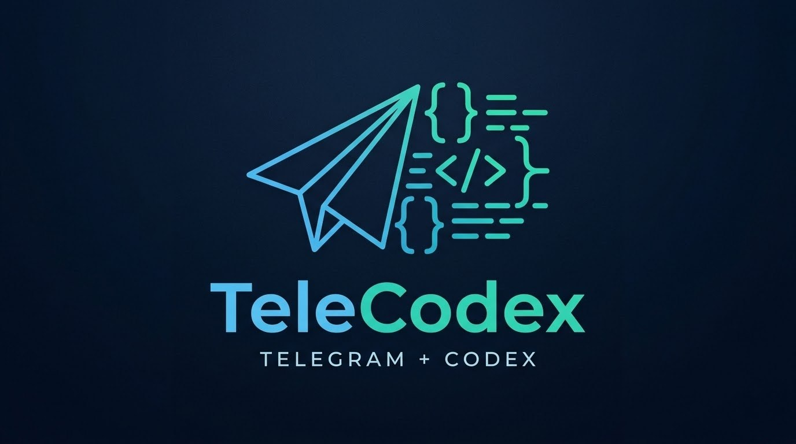
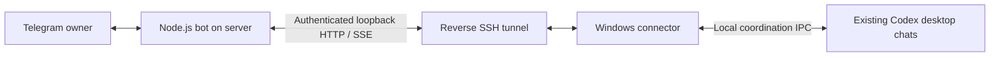

<p align="center"></p>

# TeleCodex — نسخهٔ فارسی

**ریموت تلگرام برای چت‌های فعلی Codex دسکتاپ؛ همراه ربات سرور و نصب‌کنندهٔ ویندوز**

[English](README.en.md) · [نصب کامل](docs/INSTALL.fa.md) · [معماری](docs/ARCHITECTURE.md) · [تغییرات](CHANGELOG.md) · [مجوز](LICENSE)

این مخزن نسخهٔ **فارسی ربات** است. برای ربات، نصب‌کننده و مستندات کاملاً انگلیسی،
[نسخهٔ انگلیسی TeleCodex](https://github.com/ZamaniDeveloper/telegram-codex-remote-en) را نصب کن.
هر نسخه شامل هر دو بخش ربات و رابط ویندوز است؛ از یک نسخه برای هر دو بخش استفاده کن.


توسعه‌دهنده: **Mohsen Zamani / [ZamaniDeveloper](https://github.com/ZamaniDeveloper)**

این پروژه پیام‌ها، پاسخ‌های زنده، فایل‌ها، سؤال‌ها و کنترل کار را بین تلگرام و
**همان چت‌های محلی برنامهٔ Codex ویندوز** منتقل می‌کند. مدل و مجوزهای چت در
برنامهٔ دسکتاپ باقی می‌مانند. کاتالوگ چت‌ها فقط خوانده می‌شود.

## امکانات

- منوی فارسی، دکمه‌های بومی، پاسخ زنده، متن برجسته، لینک و بلوک کد.
- انتخاب و جستجوی چت، تاریخچهٔ اخیر، توقف و راهنمایی حین اجرا.
- پاسخ به سؤال‌ها با گزینه، متن یا Reply؛ اتصال پاسخ به چت و نوبت اصلی.
- ارسال چند فوروارد، تصویر و فایل در **یک درخواست**؛ حفظ ترتیب، کپشن و اصل فایل.
- نمایش سهمیه، زمان بازنشانی به وقت تهران و اعتبارهای ریست.
- ریست فقط با اعتبار موجود و تأیید مالک؛ پیگیری نتیجهٔ نامشخص با همان شناسه.
- اجرای خودکار ویندوز پس از ورود کاربر، بازیابی رابط و اتصال مجدد SSH.
- اجرای ربات به‌صورت محلی یا روی سرور Linux با PM2؛ تنظیمات قابل‌حمل.
- یک مالک جفت‌شدهٔ تلگرام، تونل خصوصی، کلید میزبان پین‌شده و RPC محدود.

## دو بخش قابل نصب در همین مخزن

| بخش | فایل‌ها | محل اجرا |
|---|---|---|
| ربات تلگرام | `src/main.mjs`، رابط و مدیریت بسته‌ها | Linux یا ویندوز محلی |
| رابط Codex و SSH | `src/connector-supervisor.mjs` و `src/connector-server.mjs` | ویندوز دارای Codex |
| نصب و اجرای ویندوز | `setup-connector.ps1`، `install-windows.ps1` و `install-autostart.ps1` | ویندوز |
| سرویس سرور | `deploy/pm2.config.cjs` و بررسی‌های اتصال | Linux |



## شروع سریع محلی

پیش‌نیاز: ویندوز، Codex باز و واردشده، Node.js **24.17.0 یا جدیدتر** و PowerShell
**7.3 یا جدیدتر**. پروژه وابستگی npm زمان اجرا ندارد.

```powershell
git clone https://github.com/ZamaniDeveloper/telegram-codex-remote.git
cd telegram-codex-remote
npm ci --ignore-scripts
.\setup.ps1
npm start
```

توکن BotFather در ورودی مخفی گرفته می‌شود. کد `/pair ...` را در چت خصوصی ربات
بفرست، سپس با «چت‌ها» مقصد را انتخاب کن. برای اجرای محلی، تلگرام باید از ویندوز
قابل دسترسی باشد. `start.ps1` میان‌بری برای تنظیم اولیه و اجراست.

## ربات روی سرور + رابط خودکار ویندوز

[راهنمای فارسی](docs/INSTALL.fa.md) و [دستورات کامل سرور](docs/INSTALL.en.md) را اجرا کن.

```powershell
# fingerprint را از کنسول معتبر سرور بگیر.
.\setup-connector.ps1 -SshHost server.example.com -SshUser codexbridge -SshPort 22
# پس از تنظیم سرور و نصب کلید عمومی:
.\install-windows.ps1
```

تنظیمات `.connector.env`، کلید SSH و نمونهٔ خصوصی `data/server.env.generated`
محلی تولید می‌شوند. فقط کلید **عمومی** روی سرور نصب می‌شود. رابط بعد از ورود
به ویندوز اجرا می‌شود؛ کامپیوتر باید روشن و متصل باشد. در این حالت `npm start`
را روی ویندوز اجرا نکن؛ دریافت‌کنندهٔ تلگرام فقط روی سرور اجرا می‌شود.

## کار با ربات

| فرمان / دکمه | کار |
|---|---|
| `/menu`، `/start` | صفحهٔ اصلی |
| `/chats`، `/find عبارت` | انتخاب و جستجوی چت |
| پیام معمولی | درخواست در چت انتخاب‌شده |
| `/steer` یا `/steer متن` | راهنمایی به همان کار فعال |
| `/stop` | توقف نوبت فعال |
| `/status`، `/history` | وضعیت و پاسخ‌های اخیر |
| گزینه / Reply / `/answer متن` | پاسخ سؤال |
| `/batch`، `/pending` | ایجاد و مشاهدهٔ بسته |
| `/send توضیح اختیاری` | ارسال همهٔ پیام‌ها و پیوست‌ها در یک درخواست |
| `/cancel` | حذف بستهٔ ارسال‌نشده |
| `/usage`، `/quota` | سهمیه و اعتبار ریست |

فورواردها و فایل‌ها خودکار جمع می‌شوند؛ برای چند متن مستقیم ابتدا `/batch` بزن.
دستور داخل فوروارد فقط محتوای مرجع است. سقف‌ها: ۲۰ مگابایت هر فایل، ۱۰۰ پیام،
۱۰۰ مگابایت پیوست و ۱۰۰ هزار نویسه در هر بسته. صوت و ویدئو منتقل می‌شوند؛ پردازش
آن‌ها به ابزارهای چت بستگی دارد و تبدیل خودکار گفتار وجود ندارد.

## بررسی و نگهداری

```powershell
npm run verify
npm run doctor
node src/doctor.mjs THREAD_UUID
# حذف اجرای خودکار؛ فایل‌ها و کلیدها حذف نمی‌شوند:
.\uninstall-autostart.ps1
```

آزمون‌ها از سرویس‌های شبیه‌سازی‌شده و پوشه‌های موقت استفاده می‌کنند و به ربات یا
اکانت واقعی وصل نمی‌شوند. CI روی Windows و Linux اجرا می‌شود. بررسی‌های
`deploy/check-*.mjs` برای مدیر نصب‌اند؛ `check-upload` فایل آزمایشی را به ویندوز
منتقل می‌کند، بقیهٔ بررسی‌های اتصال فقط‌خواندنی‌اند. قبل از به‌روزرسانی از تنظیمات
خصوصی و `data/` پشتیبان بگیر. [عیب‌یابی و به‌روزرسانی](docs/INSTALL.en.md#updates-and-troubleshooting).

## سازگاری و حدود قابلیت

این پروژه مستقل از OpenAI و Telegram است. پروتکل دسکتاپ **خصوصی و وابسته به نسخه**
است؛ با Windows Codex `26.1002.7124.0` بررسی شده و برای هر به‌روزرسانی باید
دوباره آزمایش شود. ساخت پروژه/چت، چنداکانتی، تغییر مدل، اتصال Work ابری و ورود صوتی
مستقیم در این نسخه وجود ندارند. رابط برای ادامهٔ چت یک agent مستقل نمی‌سازد؛
عملیات سهمیه از فرایند کوتاه‌مدت account-control با ورود محلی موجود استفاده می‌کند.

دادهٔ ناموجود سهمیه نامشخص نمایش داده می‌شود. ریست به وجود اعتبار و شرایط سرویس
بستگی دارد؛ آزمون خودکار اعتبار واقعی مصرف نمی‌کند. دستور با نتیجهٔ نامشخص خودکار
تکرار نمی‌شود. فرمان‌های انباشتهٔ قبل از راه‌اندازی کنار گذاشته می‌شوند.

## حق نشر

Copyright © 2026 **Mohsen Zamani / ZamaniDeveloper**.
نصب و استفاده مجاز است؛ کپی یا بازنشر بدون نام توسعه‌دهنده، نشانی مخزن اصلی و
متن کامل [مجوز اختصاصی](LICENSE) ممنوع است. حذف نام سازنده و انتشار به نام
دیگران ممنوع است. این انتشار **source-available** است و مجوز MIT ندارد.

مخزن عمومی در GitHub قابل مشاهده و Fork است؛ این مجوز آن قابلیت پلتفرم را مسدود
نمی‌کند. [توضیح GitHub دربارهٔ مجوز و Fork](https://docs.github.com/en/repositories/managing-your-repositorys-settings-and-features/customizing-your-repository/licensing-a-repository).

[امنیت](SECURITY.md) · [مشارکت](CONTRIBUTING.md) · [معماری و منابع رسمی](docs/ARCHITECTURE.md)
